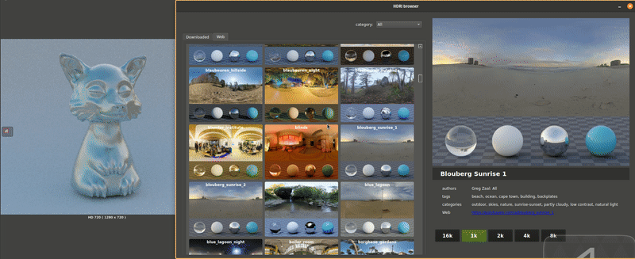

# GafferHaven
Plugin for [Gaffer](https://www.gafferhq.org/) providing direct acess to asset from [PolyHaven.com](https://polyhaven.com/).  
Only HDRIs are supported at the moment, in Cycles and Arnold lights.  
Tested on Linux, Gaffer 0.60.1.1.  

## Install
SetEnvironment variables:

	export HAVENLIBRARY="/folder/where/you/want/assets/be/stored/in"
	export GAFFER_EXTENSION_PATHS="${GAFFER_EXTENSION_PATHS}:/wherever/you/have/downloaded/GafferHaven"
	export SSL_CERT_FILE="/etc/ssl/certs/ca-certificates.crt"

SSL_CERT_FILE must point to ssl certificates on your system, this is needed in order download assets and interact with Polyhaven api.  
User must have right to write to HAVENLIBRARY path

## Usage

Go to Cycles **BackgroundLight** or Arnold's **Image** and hit **browse HDRIs** button.  
Download and use the HDRI by clicking on the button with desired resolution.  
Green icon means the file for that resolution is already downloaded.
> Note that when you go to the **Web** tab for the first time it might take couple of minutes to cache the thumbnails from the web.

## Todo/Wishlist
 - offline mode
 - better error handling / logging
 - support materials/models
 - solve SSL certificate issue -> get rid of the variable
 - better code overall

## Support Polyhaven.com
[https://www.patreon.com/polyhaven/overview](https://www.patreon.com/polyhaven/overview)